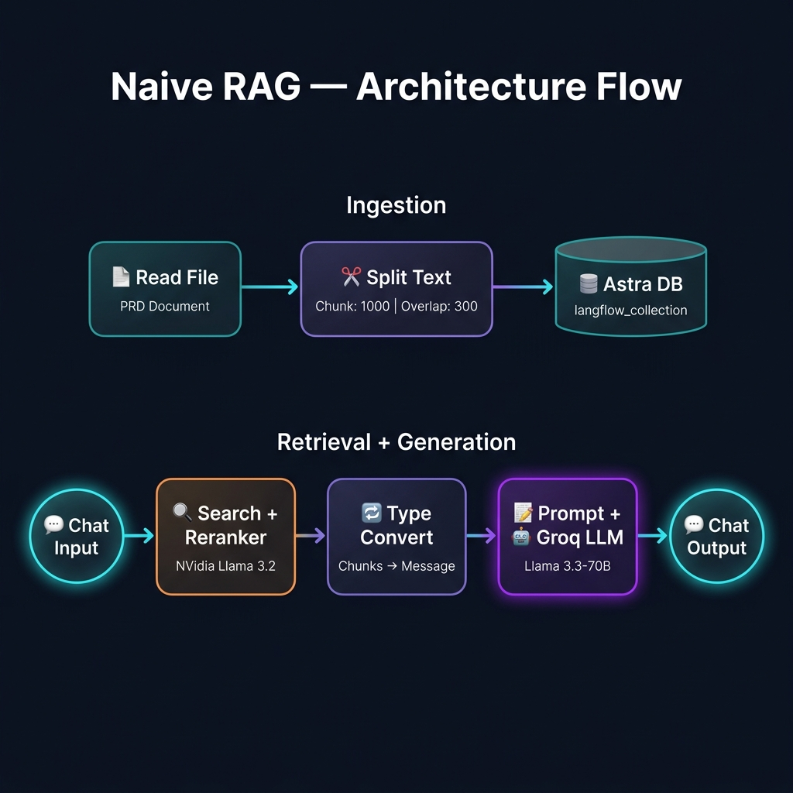
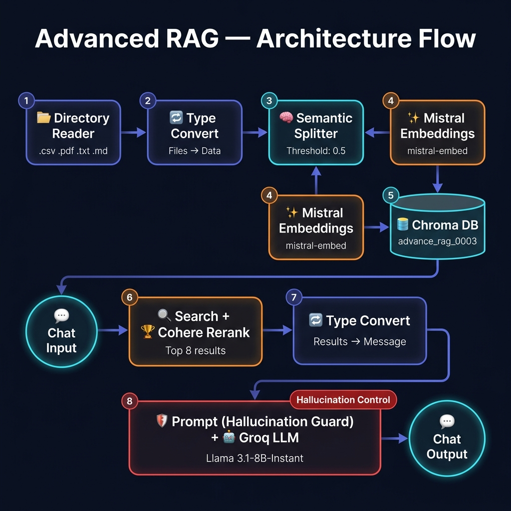
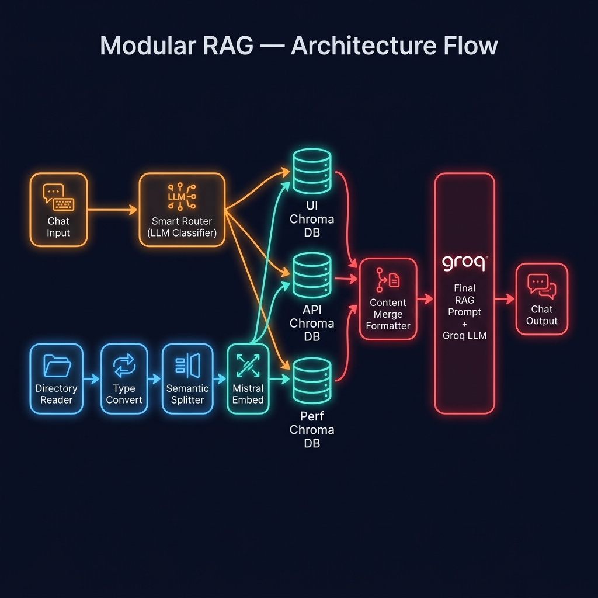

# 🧠 Langflow RAG Pipeline — Comparative Study

A hands-on exploration of three **Retrieval-Augmented Generation (RAG)** architectures built using **Langflow**, demonstrating the progressive evolution from basic document Q&A to production-grade, multi-source retrieval systems.

---

## 📖 Table of Contents

- [Overview](#-overview)
- [Project 1 — Naive RAG](#-project-1--naive-rag)
- [Project 2 — Advanced RAG](#-project-2--advanced-rag)
- [Project 3 — Modular RAG](#-project-3--modular-rag)
- [Architecture Comparison](#-architecture-comparison)
- [Tech Stack](#-tech-stack)
- [Getting Started](#-getting-started)
- [License](#-license)

---

## 🌟 Overview

This repository contains **three distinct RAG pipeline implementations**, each increasing in sophistication:

| # | Pipeline | Key Concept | Vector Store | LLM | Hallucination Control |
|---|----------|-------------|-------------|-----|----------------------|
| 1 | **Naive RAG** | Basic Retrieval → Generate | Astra DB | Groq (Llama 3.3 70B) | ❌ None |
| 2 | **Advanced RAG** | Semantic Chunking + Re-Ranking | Chroma DB | Groq (Llama 3.1 8B Instant) | ✅ Strong |
| 3 | **Modular RAG** | Multi-Store Routing + Smart Router | Chroma DB (×3 collections) | Groq (Llama 3.3 70B) | ✅ Strongest |

All pipelines are built visually in **Langflow** and consume a **Product Requirements Document (PRD)** as the knowledge base, answering natural-language questions about the product.

---

## 📂 Project 1 — Naive RAG

> **Directory:** `Naive RAG using Langflow/`

### What It Does

The simplest RAG pattern — load a document, chunk it, embed it, store it, and retrieve relevant chunks to answer user queries.

### Pipeline Phases

```
Phase 1: Load Data          → Read File (Product Requirements Document)
Phase 2: Chunk the Data     → Split Text (Chunk Size: 1000, Overlap: 300)
Phase 3: Store in DB        → Astra DB (langflow_collection)
Phase 4: Retrieve Results   → Astra DB Search + NVidia Llama 3.2 NV Reranker
Phase 5: Convert to Message → Type Convert (Chunks → Message)
Phase 6: Generate Response  → Prompt Template + Groq (Llama 3.3 70B Versatile)
```

### Architecture Diagram



### Sample Outputs

| Query | Response |
|:------|:---------|
| *"What are all the target users in the VMO application?"* | Lists Primary Users (CRO Specialists, Product Managers, UX Designers, Digital Marketers, Analysts) and Secondary Users (Engineering teams, Business executives) |
| *"What does DXO stand for?"* | Digital Experience Optimization |
| *"What is the product URL?"* | https://app.vwo.com/ |

### Key Characteristics

- ✅ Simple and fast to set up
- ✅ Good for small, single-document knowledge bases
- ⚠️ No semantic awareness during chunking (fixed-size splits)
- ⚠️ No hallucination guardrails — may fabricate answers for out-of-context queries

### Files

| File | Description |
|------|-------------|
| `naive_rag_langflow.json` | Langflow pipeline export (importable) |
| `Naive_RAG-Langflow.png` | Full pipeline screenshot |
| `Naive_RAG-Langflow (output_1).png` | Output — target users query |
| `Naive_RAG-Langflow (output_2).png` | Output — DXO & product URL queries |

---

## 🚀 Project 2 — Advanced RAG

> **Directory:** `Advanced RAG using langflow/`

### What It Does

Improves upon Naive RAG by introducing **semantic text splitting**, **Mistral AI embeddings**, and **Cohere Re-Ranking** for significantly better retrieval accuracy and hallucination control.

### Pipeline Phases

```
Phase 1: Load Data          → Directory Reader (Recursive, supports .csv, .pdf, .txt, .md)
Phase 2: Convert            → Type Convert (Files → Data)
Phase 3: Semantic Chunking  → Semantic Text Splitter (percentile threshold: 0.5, 5 chunks)
Phase 4: Generate Embeddings → Mistral Embeddings (mistral-embed model)
Phase 5: Store in DB        → Chroma DB (advance_rag_0003 collection)
Phase 6: Retrieve & Re-Rank → Chroma DB Search + Cohere Rerank (rerank-english-v3.0, Top 8)
Phase 7: Convert to Message → Type Convert (Search Results → Message)
Phase 8: Generate Response  → Prompt Template (with Rules) + Groq (Llama 3.1 8B Instant)
```

### Architecture Diagram



### Hallucination Control

The Advanced RAG pipeline includes explicit **rules in the prompt template** to prevent hallucinations:

> *"Answer the question using ONLY the information provided in the context. Rules: If the answer is not in the context, say 'I don't have enough context to answer that.'"*

**Tested with out-of-context questions:**

| Query | Response |
|:------|:---------|
| *"When was VWO founded?"* | "I don't have enough context to answer that." ✅ |
| *"Does VWO offer a free trial?"* | "I don't have enough context to answer that." ✅ |
| *"What programming language is VWO built with?"* | "I don't have enough context to answer that." ✅ |

### Sample Outputs (In-Context)

| Query | Response |
|:------|:---------|
| *"What behavioral insight tools are available in VWO?"* | Heatmaps (click, scroll, focus), Session recordings, On-page surveys & feedback, Funnel analytics [Source-1] |
| *"What testing methods are included in VWO?"* | A/B Testing, Split URL Testing, Multivariate Testing [Source-1] |
| *"What workflow management capabilities does VWO provide?"* | Kanban style workflows for experiment backlogs [Source-1] |

### Key Improvements Over Naive RAG

- ✅ **Semantic Chunking** — splits text by meaning, not arbitrary size
- ✅ **Mistral Embeddings** — high-quality vector representations
- ✅ **Cohere Re-Ranking** — re-orders retrieved chunks by relevance before generation
- ✅ **Hallucination Prevention** — refuses to answer out-of-context questions
- ✅ **Source Attribution** — responses include `[Source-N]` references
- ✅ **Multi-format Ingestion** — reads from directories (CSV, PDF, TXT, MD)

### Files

| File | Description |
|------|-------------|
| `Advanced_RAG-Langflow.json` | Langflow pipeline export (importable) |
| `Advanced RAG - LangFlow.png` | Full pipeline screenshot |
| `Advanced RAG - Output check (1).png` | Output — behavioral tools & testing methods |
| `Advanced RAG - Output check (2).png` | Output — workflow & company usage queries |
| `Advanced RAG - Output check (to test hallucination control).png` | Output — hallucination control validation |

---

## 🏗️ Project 3 — Modular RAG

> **Directory:** `Modular RAG using Langflow/`

### What It Does

The most sophisticated pipeline — implements a **modular, multi-collection architecture** with an **intelligent Smart Router** that directs queries to the appropriate vector store based on topic classification. This approach mirrors production-grade RAG systems.

### Pipeline Phases

```
Phase 1: Load Data          → Modular Source Data (Directory Reader, .pdf, .txt, .md, .csv)
Phase 2: Convert            → To Data (Type Convert)
Phase 3: Semantic Chunking  → Semantic Splitter (percentile threshold, 5 chunks)
Phase 4: Generate Embeddings → Mistral Embeddings (mistral-embed model)
Phase 5: Multi-Store Ingest → 3 Separate Chroma DB Collections:
                               ├── modular_ui_block        (UI-related chunks)
                               ├── modular_api_store       (API/Integration chunks)
                               └── modular_performance_block (Performance chunks)
Phase 6: Smart Routing      → Groq LLM classifies query → Smart Router routes to correct store
Phase 7: Merge Results      → Content Merge Formatter (combines multi-store results)
Phase 8: Generate Response  → Final RAG Prompt + Groq (Llama 3.3 70B Versatile)
```

### Architecture Diagram



### Smart Router Logic

The pipeline uses a **Groq-powered Smart Router** that:
1. Receives the user query
2. Classifies it into a category (UI, API, Performance)
3. Routes to the corresponding Chroma DB collection
4. Returns the most relevant domain-specific chunks

This dramatically reduces noise and improves answer precision.

### Sample Outputs

| Query | Response |
|:------|:---------|
| *"How does VWO handle performance?"* | VWO handles performance through its Performance Module focusing on system performance, scalability, and reliability. 99.9% uptime SLA and stable performance under load. |
| *"How can UI changes increase conversion rates?"* | By identifying UX bottlenecks, improving layout and design decisions, and optimizing conversion paths through A/B testing, heatmaps, and funnel analysis. |
| *"Key features in API?"* | Integration with Shopify, Salesforce, WordPress; data synchronization; tracking and reporting integrations; analytics tools; event tracking; external data pipelines. |
| *"What is mobile?"* | "I don't know. The provided context does not mention or define 'mobile'." ✅ |

### Key Improvements Over Advanced RAG

- ✅ **Multi-Collection Architecture** — domain-specific vector stores for UI, API, and Performance
- ✅ **Intelligent Query Routing** — LLM-powered classification directs queries to the right knowledge base
- ✅ **Content Merge Formatter** — combines results from multiple stores into coherent responses
- ✅ **Higher Precision** — reduces irrelevant chunk retrieval by querying domain-specific stores
- ✅ **Scalable Design** — easily add new collections/domains without rebuilding the pipeline
- ✅ **Strongest Hallucination Control** — refuses fabricated answers with clear explanations

### Files

| File | Description |
|------|-------------|
| `Modular RAG.json` | Langflow pipeline export (importable) |
| `Modular_RAG-Langflow.png` | Full pipeline screenshot |
| `Modular_RAG-Langflow(Output_1).png` | Output — performance & UI conversion queries |
| `Modular_RAG-Langflow(Output_2).png` | Output — heatmaps & API features queries |
| `Modular_RAG-Langflow(Output_3).png` | Output — hallucination control ("what is mobile") |

---

## 📊 Architecture Comparison

### Evolution: Naive → Advanced → Modular

```
┌─────────────────────────────────────────────────────────────────────┐
│  1️⃣  NAIVE RAG — Simple Retrieval                                  │
│                                                                     │
│  📄 Single File → ✂️ Fixed Chunks → 📦 Astra DB → 🤖 Groq 70B → 💬 │
│                    (1000 chars)      (1 Store)                      │
└──────────────────────────────┬──────────────────────────────────────┘
                               │
                   + Semantic Chunking
                   + Re-Ranking (Cohere)
                   + Hallucination Control
                               │
                               ▼
┌─────────────────────────────────────────────────────────────────────┐
│  2️⃣  ADVANCED RAG — Semantic + Re-Ranking                          │
│                                                                     │
│  📂 Directory → 🧠 Semantic → 📦 Chroma DB → 🏆 Re-Rank → 🛡️ Guard │
│  (Multi-format)   Chunks       (1 Store)      (Cohere)      ↓       │
│                                                     🤖 Groq 8B → 💬 │
│                                                     [Source-N]      │
└──────────────────────────────┬──────────────────────────────────────┘
                               │
                   + Multi-Store (3 Collections)
                   + Smart Query Routing
                   + Content Merging
                               │
                               ▼
┌─────────────────────────────────────────────────────────────────────┐
│  3️⃣  MODULAR RAG — Multi-Store + Smart Router                      │
│                                                                     │
│  📂 Directory → 🧠 Semantic → ┬─ 🎨 UI Store                       │
│  (Multi-format)   Chunks      ├─ 🔌 API Store    → 🔗 Merge        │
│                               └─ ⚡ Perf Store      ↓              │
│                                       ▲         🛡️ Guard            │
│                    💬 → 🤖 Classifier → 🔀 Router    ↓              │
│                                                 🤖 Groq 70B → 💬   │
└─────────────────────────────────────────────────────────────────────┘
```

### Feature Matrix

| Feature | Naive RAG | Advanced RAG | Modular RAG |
|---------|:---------:|:------------:|:-----------:|
| Document Loading | Single File | Directory (Multi-format) | Directory (Multi-format) |
| Text Splitting | Fixed Size (1000 chars) | Semantic (Meaning-based) | Semantic (Meaning-based) |
| Embeddings | Astra DB Built-in | Mistral AI | Mistral AI |
| Vector Store | Astra DB (Cloud) | Chroma DB (Local) | Chroma DB (Local × 3) |
| Re-Ranking | NVidia Reranker | Cohere Rerank v3.0 | — |
| Query Routing | ❌ | ❌ | ✅ Smart Router |
| Multi-Store | ❌ | ❌ | ✅ 3 Collections |
| Hallucination Control | ❌ | ✅ Rule-based | ✅ Rule-based |
| Source Attribution | ❌ | ✅ `[Source-N]` | ✅ Context-aware |
| LLM | Groq Llama 3.3 70B | Groq Llama 3.1 8B | Groq Llama 3.3 70B |
| Best For | Prototyping | Production (Single-domain) | Production (Multi-domain) |

---

## 🛠️ Tech Stack

| Component | Technology |
|-----------|------------|
| **Pipeline Builder** | [Langflow](https://www.langflow.org/) (Visual LLM workflow builder) |
| **LLM Provider** | [Groq](https://groq.com/) (Llama 3.1 / 3.3 models) |
| **Embeddings** | [Mistral AI](https://mistral.ai/) (`mistral-embed`) |
| **Vector Stores** | [Astra DB](https://www.datastax.com/products/datastax-astra) (Cloud) / [Chroma DB](https://www.trychroma.com/) (Local) |
| **Re-Ranker** | [Cohere](https://cohere.com/) (`rerank-english-v3.0`) / NVidia Reranker |
| **Hosting** | Astra Datastax (Naive RAG) / Localhost:7860 (Advanced & Modular) |

---

## 🚀 Getting Started

### Prerequisites

- **Langflow** installed locally (`pip install langflow`) or access to [Astra Datastax Langflow](https://astra.datastax.com)
- API Keys for:
  - **Groq** — LLM inference
  - **Mistral AI** — Embeddings (Advanced & Modular only)
  - **Cohere** — Re-ranking (Advanced only)
  - **Astra DB** — Vector storage (Naive only)

### Import a Pipeline

1. Open Langflow (local or cloud)
2. Click **Import** or **Upload**
3. Select the `.json` file from the desired project folder:
   - `Naive RAG using Langflow/naive_rag_langflow.json`
   - `Advanced RAG using langflow/Advanced_RAG-Langflow.json`
   - `Modular RAG using Langflow/Modular RAG.json`
4. Configure your API keys in each component node
5. Upload your knowledge base document(s)
6. Open the **Playground** and start querying!

---

## 📂 Repository Structure

```
Langflow_RAG_Pipeline/
├── README.md
├── Naive RAG using Langflow/
│   ├── naive_rag_langflow.json          # Pipeline export
│   ├── Naive_RAG-Langflow.png           # Architecture screenshot
│   ├── Naive_RAG-Langflow (output_1).png
│   └── Naive_RAG-Langflow (output_2).png
├── Advanced RAG using langflow/
│   ├── Advanced_RAG-Langflow.json       # Pipeline export
│   ├── Advanced RAG - LangFlow.png      # Architecture screenshot
│   ├── Advanced RAG - Output check (1).png
│   ├── Advanced RAG - Output check (2).png
│   └── Advanced RAG - Output check (to test hallucination control).png
└── Modular RAG using Langflow/
    ├── Modular RAG.json                 # Pipeline export
    ├── Modular_RAG-Langflow.png         # Architecture screenshot
    ├── Modular_RAG-Langflow(Output_1).png
    ├── Modular_RAG-Langflow(Output_2).png
    └── Modular_RAG-Langflow(Output_3).png
```

---

## 📜 License

This project is open source and available for educational and reference purposes.

---

> **Author:** Naveen Ravichandran  
> **Domain:** AI / QA Engineering / RAG Systems
